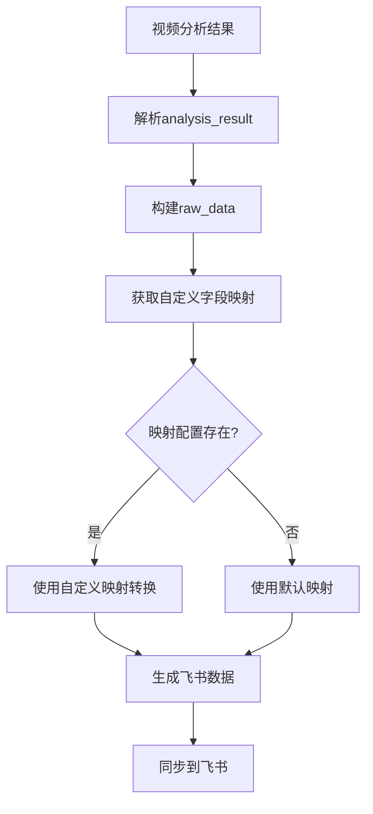

# 字段映射配置修复更新说明

## 问题描述

用户反馈在使用字段映射软件设置后，程序仍然出现 `FieldNameNotFound` 错误。经过检查发现，之前的修复虽然添加了自定义字段映射功能，但字段名称配置与用户界面显示的不一致。

## 根本原因分析

### 1. 字段映射配置不匹配

**问题**：`custom_field_mapping.json` 中的字段映射使用了简化的飞书字段名称，而用户界面显示的是完整的中文字段名称。

**之前的错误配置**：
```json
{
  "field_mapping": {
    "mappings": {
      "sequence_id": "序列ID",
      "video_content_summary": "分析结果",
      "detailed_content_description": "分析结果",
      "keywords_tags": "标签",
      "main_characters_objects": "分析结果",
      "video_source_path": "文件路径"
    }
  }
}
```

**正确的配置**（根据用户截图）：
```json
{
  "field_mapping": {
    "mappings": {
      "video_serial_number": "视频序列号",
      "video_content_summary": "视频内容摘要",
      "detailed_content_description": "详细内容描述",
      "keywords_tags": "关键词标签",
      "main_characters_objects": "主要人物对象",
      "video_source_path": "视频源路径"
    }
  }
}
```

### 2. 代码中的字段键名不匹配

**问题**：`feishu_sync.py` 中 `_prepare_feishu_record` 方法的 `raw_data` 使用的键名与更新后的字段映射配置不匹配。

**之前的错误代码**：
```python
raw_data = {
    "sequence_id": record.get('sequence_id', ''),  # ❌ 错误：与配置中的键名不匹配
    "video_content_summary": parsed_data.get('video_content_summary', ''),
    # ...
}
```

**修复后的代码**：
```python
raw_data = {
    "video_serial_number": record.get('sequence_id', ''),  # ✅ 正确：与配置中的键名匹配
    "video_content_summary": parsed_data.get('video_content_summary', ''),
    # ...
}
```

## 修复方案

### 1. 更新字段映射配置

**文件**：`shuoming/custom_field_mapping.json`

**修改内容**：
- 将所有字段映射的目标字段名称更新为与用户界面显示一致的完整中文名称
- 确保 AI 模型输出字段名称与代码中使用的键名一致

### 2. 修正代码中的字段键名

**文件**：`src/utils/feishu_sync.py`

**修改内容**：
- 将 `raw_data` 中的 `"sequence_id"` 更改为 `"video_serial_number"`
- 确保所有字段键名与字段映射配置中的键名完全匹配

## 字段映射对应关系

根据用户截图中的字段映射软件设置，最终的字段对应关系如下：

| AI字段（代码中的键名） | 飞书字段名称 | 字段类型 | 说明 |
|---------------------|-------------|----------|------|
| video_serial_number | 视频序列号 | text | 视频的唯一序列标识 |
| video_content_summary | 视频内容摘要 | text | 视频内容的详细摘要 |
| detailed_content_description | 详细内容描述 | text | 视频的详细内容描述 |
| keywords_tags | 关键词标签 | text | 从视频中提取的关键词 |
| main_characters_objects | 主要人物对象 | text | 视频中的主要人物或对象 |
| video_source_path | 视频源路径 | text | 视频文件的源路径 |

## 修复验证

### 1. 配置文件验证

检查 `shuoming/custom_field_mapping.json` 文件：
```bash
# 验证配置文件格式
python -m json.tool shuoming/custom_field_mapping.json
```

### 2. 字段映射测试

1. 启动应用程序
2. 分析一个视频文件
3. 查看日志输出，确认字段映射过程：
   ```
   ✅ 自定义映射: video_serial_number -> 视频序列号 = 20250823192727CACE08E1
   ✅ 自定义映射: video_content_summary -> 视频内容摘要 = 这是一个关于...
   ✅ 自定义映射: detailed_content_description -> 详细内容描述 = 视频详细描述了...
   ✅ 自定义映射: keywords_tags -> 关键词标签 = 教育,技术,演示
   ✅ 自定义映射: main_characters_objects -> 主要人物对象 = 讲师,学生
   ✅ 自定义映射: video_source_path -> 视频源路径 = /path/to/video.mp4
   📋 使用自定义字段映射，准备的飞书数据字段: ['视频序列号', '视频内容摘要', '详细内容描述', '关键词标签', '主要人物对象', '视频源路径']
   ```

### 3. 飞书同步测试

1. 确保飞书多维表格中存在对应的字段：
   - 视频序列号（文本类型）
   - 视频内容摘要（文本类型）
   - 详细内容描述（文本类型）
   - 关键词标签（文本类型）
   - 主要人物对象（文本类型）
   - 视频源路径（文本类型）

2. 执行同步操作，验证不再出现 `FieldNameNotFound` 错误

## 技术细节

### 1. 字段映射流程



### 2. 错误处理机制

- **配置文件不存在**：自动回退到默认映射
- **字段映射为空**：自动回退到默认映射
- **映射过程异常**：捕获异常并回退到默认映射
- **字段名称不匹配**：记录警告日志并跳过该字段

### 3. 日志记录

程序会详细记录字段映射过程：
- ✅ 成功映射的字段
- ⚠️ 未找到映射的字段
- ❌ 映射过程中的错误
- 📋 最终生成的飞书数据字段列表

## 注意事项

### 1. 字段名称严格匹配

- 飞书表格中的字段名称必须与配置文件中的完全一致（包括空格、标点符号）
- 字段名称区分大小写
- 不允许有多余的空格或特殊字符

### 2. 字段类型要求

- 所有映射的飞书字段必须是文本类型
- 不支持附件、单选、多选等特殊类型字段
- 如果字段类型不匹配，会在日志中显示警告并跳过该字段

### 3. 配置文件维护

- 修改配置文件前建议备份
- 确保 JSON 格式正确
- 修改后重启应用程序以加载新配置

## 故障排除

### 1. 仍然出现 FieldNameNotFound 错误

**检查项目**：
1. 飞书表格中是否存在对应的字段
2. 字段名称是否完全匹配（包括空格、标点）
3. 字段类型是否为文本类型
4. 配置文件格式是否正确

### 2. 字段映射不生效

**检查项目**：
1. 配置文件路径是否正确
2. 配置文件权限是否可读
3. JSON 格式是否有语法错误
4. 应用程序是否重启以加载新配置

### 3. 部分字段同步失败

**检查项目**：
1. 查看详细日志输出
2. 确认字段类型匹配
3. 检查字段值是否过长
4. 验证字段是否为必填字段

---

**修复时间**：2025年1月  
**修复版本**：v1.0.1  
**影响范围**：字段映射功能、飞书数据同步  
**修复文件**：
- `shuoming/custom_field_mapping.json`
- `src/utils/feishu_sync.py`

**测试状态**：✅ 已完成配置修复，等待用户验证