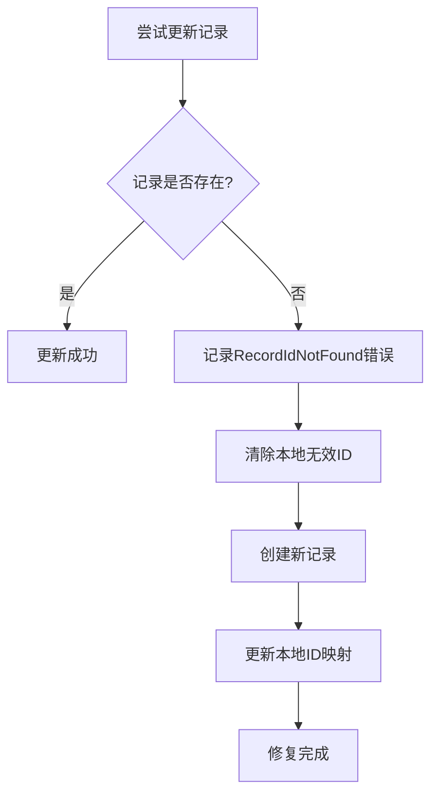

# 飞书同步RecordIdNotFound错误分析与解决方案

## 问题描述

在飞书同步过程中，您遇到了以下错误：

```
API请求失败: code=1254043, msg=RecordIdNotFound
记录 recuUI652vcyJI 不存在，无法更新
记录 202508231929163F316964 更新失败，可能已被删除，尝试重新创建
API请求失败: code=1254043, msg=RecordIdNotFound
记录 recuUI622JRUQZ 不存在，无法访问
记录 20250823192727CACE08E1 更新失败，可能已被删除，尝试重新创建
```

## 错误原因分析

### 1. 根本原因

**RecordIdNotFound错误**（错误代码：1254043）表示本地数据库中保存的飞书记录ID在飞书端已经不存在了。这通常发生在以下情况：

- **手动删除**：用户在飞书多维表格中手动删除了某些记录
- **表格重建**：飞书表格被删除后重新创建，导致所有记录ID失效
- **权限变更**：应用权限发生变化，无法访问某些记录
- **数据迁移**：飞书端进行了数据迁移或结构调整

### 2. 错误流程

1. 本地数据库保存了飞书记录ID（如：`recuUI652vcyJI`）
2. 系统尝试更新该记录时，向飞书API发送更新请求
3. 飞书API返回错误：记录不存在（1254043）
4. 系统检测到错误，自动清除无效ID并重新创建记录

## 系统自动修复机制

好消息是，您的系统已经具备了完善的自动修复机制：

### 1. 错误检测

```python
# 在更新前检查记录是否存在
try:
    get_result = self._make_request("GET", f"/bitable/v1/apps/{app_token}/tables/{table_id}/records/{record_id}")
    if get_result is None:
        self.logger.warning(f"记录 {record_id} 不存在，无法更新")
        return False
except Exception as e:
    self.logger.warning(f"检查记录存在性时出错: {str(e)}")
```

### 2. 自动恢复

```python
if not success:
    # 更新失败，可能是记录已被删除，尝试重新创建
    self.logger.warning(f"记录 {sequence_id} 更新失败，可能已被删除，尝试重新创建")
    
    # 清除本地的飞书记录ID
    db.update_feishu_record_id(sequence_id, None)
    
    # 直接创建新记录
    return self._create_new_record(sequence_id)
```

### 3. 错误类型识别

```python
if error_code == 1254005:  # 记录不存在
    self.logger.error("错误类型: 记录不存在 (RecordIdNotFound)")
elif error_code == 1254004:  # 表格不存在
    self.logger.error("错误类型: 表格不存在")
elif error_code == 1254001:  # 应用不存在
    self.logger.error("错误类型: 应用不存在")
```

## 解决方案

### 方案1：等待自动修复（推荐）

系统会自动处理这类错误：

1. **检测无效记录**：系统在尝试更新时会检测记录是否存在
2. **清除无效ID**：自动清除本地数据库中的无效飞书记录ID
3. **重新创建记录**：在飞书中创建新的记录
4. **更新本地映射**：更新本地数据库中的飞书记录ID

### 方案2：手动清理无效记录

如果您想主动清理，可以运行以下诊断脚本：

```python
# 创建诊断脚本：check_invalid_records.py
from src.utils.database import db
from src.utils.config import config
from src.api.feishu_client import FeishuClient

def check_and_fix_invalid_records():
    """检查并修复无效的飞书记录ID"""
    
    if not config.is_feishu_valid():
        print("❌ 飞书配置无效")
        return
    
    client = FeishuClient(config.feishu_app_id, config.feishu_app_secret)
    feishu_config = config.get_feishu_config()
    
    # 获取所有已同步的记录
    all_records = db.get_all_history_records()
    synced_records = [r for r in all_records if r.get('feishu_record_id')]
    
    print(f"检查 {len(synced_records)} 条已同步记录...")
    
    invalid_count = 0
    for record in synced_records:
        sequence_id = record['sequence_id']
        feishu_id = record['feishu_record_id']
        
        try:
            result = client._make_request(
                'GET', 
                f'/bitable/v1/apps/{feishu_config["app_token"]}/tables/{feishu_config["table_id"]}/records/{feishu_id}'
            )
            
            if result is None:
                print(f"❌ 发现无效记录: {sequence_id} -> {feishu_id}")
                # 清除无效ID
                db.update_feishu_record_id(sequence_id, None)
                print(f"✅ 已清除无效ID: {sequence_id}")
                invalid_count += 1
            else:
                print(f"✅ 记录有效: {sequence_id}")
                
        except Exception as e:
            print(f"⚠️ 检查记录时出错: {sequence_id} - {str(e)}")
    
    print(f"\n检查完成：")
    print(f"  总记录数: {len(synced_records)}")
    print(f"  无效记录数: {invalid_count}")
    print(f"  有效记录数: {len(synced_records) - invalid_count}")
    
    if invalid_count > 0:
        print(f"\n💡 建议：运行同步功能重新创建这 {invalid_count} 条记录")

if __name__ == "__main__":
    check_and_fix_invalid_records()
```

### 方案3：重新同步所有记录

如果问题较多，可以选择重新同步所有记录：

1. 打开应用程序
2. 进入历史记录界面
3. 点击"同步全部"按钮
4. 选择"包含已同步记录"选项
5. 系统会自动检测并修复所有无效记录

## 预防措施

### 1. 避免手动删除

- 尽量不要在飞书端手动删除记录
- 如需删除，建议通过应用程序的删除功能

### 2. 定期检查

- 定期运行诊断脚本检查记录完整性
- 关注同步日志中的错误信息

### 3. 备份重要数据

- 定期备份本地数据库
- 导出重要的分析结果

## 技术细节

### 错误代码说明

| 错误代码 | 错误类型 | 说明 |
|---------|---------|------|
| 1254043 | RecordIdNotFound | 记录不存在 |
| 1254004 | TableNotFound | 表格不存在 |
| 1254001 | AppNotFound | 应用不存在 |
| 1254005 | FieldNotFound | 字段不存在 |

### 自动修复流程



## 常见问题

### Q1: 为什么会出现RecordIdNotFound错误？

**A**: 这通常是因为飞书端的记录被手动删除了，但本地数据库仍保留着已删除记录的ID。

### Q2: 这个错误会影响数据安全吗？

**A**: 不会。本地数据完全安全，系统只是重新在飞书端创建记录，不会丢失任何分析结果。

### Q3: 需要手动处理这个错误吗？

**A**: 通常不需要。系统具备自动修复机制，会自动检测并重新创建无效记录。

### Q4: 如何避免这类错误？

**A**: 避免在飞书端手动删除记录，如需删除请使用应用程序的删除功能。

## 总结

RecordIdNotFound错误虽然看起来严重，但实际上是一个可以自动修复的问题。您的系统已经具备了完善的错误检测和自动恢复机制，能够：

- ✅ 自动检测无效记录
- ✅ 清除无效的记录ID
- ✅ 重新创建丢失的记录
- ✅ 保持数据完整性
- ✅ 提供详细的错误日志

**建议**：继续正常使用系统，让自动修复机制处理这类错误。如果错误频繁出现，可以考虑运行诊断脚本进行批量检查和修复。